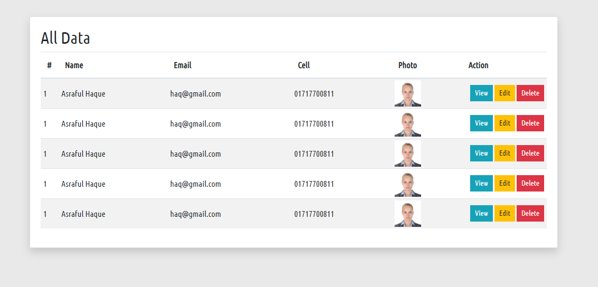

#Student Crud ny OOP 

Pject for OOP. It's a crud system with Database helper methosThis is a learning purpose pro




#### Features 
- Student Add to Database
- Student Show 
- Single Student Data
- Edit student Data
- Update Student Data

#### Database Class Design
```php

namespace  App\Support;

use mysqli;

/**
 * Class Database
 * @package App\Support
 */
abstract class Database {

    // Attributes
    private $host = "localhost";
    private $user = "root";
    private $pass = "";
    private $db   = "crud";

    private $connection ;


    /**
     * database connection
     * @return mysqli
     */
    private function connection()
    {
      return $this -> connection = new mysqli($this ->host, $this ->user, $this ->pass, $this ->db );
    }

    /**
     * Insert data to database table
     * @param $sql
     */
    protected function create($sql){
        return $this ->connection() -> query($sql);
    }


    /**
     * Select  all data form any table
     * @param $table
     */
    protected function all($table, $order = 'DESC'){
        return $this ->connection() -> query("SELECT * FROM $table ORDER BY id $order");
    }


    /**
     *
     * @param $table
     * @param $id
     */
    protected function find($table, $id){

    }

    /**
     * Update any data from any table
     * @param $sql
     */
    protected function update($sql){

    }

    /**
     * Delete any data from any table
     * @param $table
     * @param $id
     */
    protected function delete($table, $id){

    }


}
```

#### Student Class Design
```php


namespace App\Controllers;


use App\Support\Database;

/**
 * Class Student
 * @package App\Controllers
 */
class Student extends Database {

    /**
     * @param $name
     * @param $email
     * @param $cell
     * @param $uname
     */
    public function createStudent($name, $email, $cell, $uname)
    {

        $this ->create("INSERT INTO users (name, email, cell, uname) VALUES ('$name','$email','$cell','$uname')");

    }


    /**
     * Get all student data
     */
    public function allStudents()
    {
        $data = $this ->all('users');

        return $data;
    }


}


```